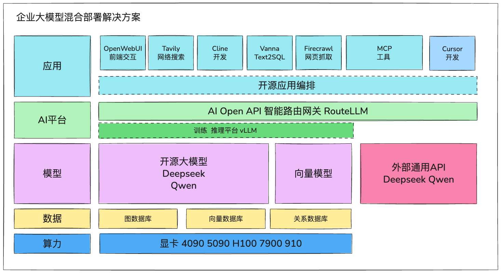

# AI驱动软件工程

## 简介

这是一篇对如何使用AI进行软件开发的经验总结与探索，包括

1. AI赋能软件开发的背景与挑战
2. 企业类型与适配AI策略
3. 软件生命周期中的AI价值点
4. 面向AI的软件开发原则
5. 一些AI工具的实践经验
6. AI平台的构建
7. 投入产出 ROI，合规
8. 组织层面推进AI开发的建议

### 1. AI赋能软件开发的背景与挑战

AI 大语言模型在编程领域进步尤为迅速。
    一方面，程序员因担忧职业被替代而有所抵触，并出现防御性反应；但是，也有大量开发者积极尝试，希望掌握 AI 成为 AI Master。
    一方面，企业家，管理者们，有的希望AI能带来可观的降本增效，有的希望抓住机会起飞，也有的在不屑，观望，根本不看。

站在企业的角度，落后企业最常提到的，是 AI 应用带来的安全性和风险问题。

我们这里只讨论，在公开市场的软件公司，AI工具应用方面的安全性，风险（不考虑军品国企）。

使用大语言模型服务，使用AI辅助编程工具，会把数据，信息，代码发送到服务提供方。

大公司的解决方案是，自建平台，比如国外的谷歌微软，国内的字节阿里美团，都有自己的开发工具。同时也对外公开，作为产品参与竞争。

小公司，如果是自研产品，即使有被抄袭复制的担心，也应该放开手脚，彻底的紧追AI。

为客户提供研发服务的小公司，客户有顾虑，暂时不能接受把他的代码库对AI服务开放，虽然未来是必然，但这个时间差怎么办？

#### AI 是机会
- 对于研发服务型企业，在AI的帮助下，能快速提高企业能力，拓宽企业机会，增大竞争潜力。公司熟悉的业务可以通过AI助力加深业务能力，相对陌生的业务，可以通过AI快速掌握，提高企业竞争力。
- 对于研发人员，从开发者角度，AI是通往自由之路，大大加速陌生技术的上手时间，可以用AI增强已有的技术能力。弥补短板，增加了更多的可能。
- 对于自研产品的企业，是机会，无论是AI赋能自身，还是用AI嵌入产品，都存在巨大的机会。

## 2. 企业类型与适配AI策略

### 2.1. 企业类型

软件公司有很多类型，有对外提供软件服务，软件产品研发的服务型公司，有自研软件服务，软件产品的公司。

软件企业的业务类型可以抽象为两类，一类是，产品服务是自己的，一类是，产品服务是客户，

自己的产品的大公司，某种程度上需要对产品信息作一定程度的保护，所以，会对AI应用有顾虑。

对外服务型的公司，由客户决定，需要考虑到客户极端保守的情况。

另外，产品面向行业的不同也有不同的约束（金融，互联网，嵌入式）。

多种场景下，需要分别对代码与客户数据安全制定方案，对AI的工具的应用，有顾虑。需要采用自建大模型推理服务基座，作为AI应用的基础服务。

### 2.2. AI 应用的策略

比较稳妥的策略是采用「工具试用→流程试点→全流程整合」三阶段方案。
初期可选用免费 / 低价工具（如开源的 Cline + DeepSeek）开展代码生成试点；
中期构建内部提示词库与模板库（如常见业务场景的代码生成模板）；
后期逐步引入私有化部署模型（如基于 DeepSeek Qwen 模型私有化部署），降低对外部服务的依赖。

## 3. 软件生命周期中的AI价值点

### 软件项目类型

1. 开发全新的项目。
2. 在旧的产品项目上打补丁，功能追加。
3. 升级古老的旧的项目。在老产品的基础上开发新的产品。

### 3.1. 全新的项目

这是最理想的状况，也是AI潜力最大，最不容易把握的状况，因为，在任何情况下，你说什么，AI都会给你回答，当你没有对业务需求，设计充分思考的情况下，你可能觉得AI有道理，被他误导，远离真正的目标。

**最高原则是，人主导设计**，在向AI提问寻求帮助前，给他充分，足够的信息，要求。也就是足够好的提示词。

#### 在寻求客户机会，提案阶段。
    
- AI能帮助分析客户特征，市场价值，市场潜力，从而做出更有针对性，更能打动客户的方案。
    
- AI还能模拟客户，对方案进行评审，批评建议，利用他对方案迭代改善。
    
- AI还可以帮助我们准备客户会议，无论是演示文档，演示视频，模拟会议交流问题，都可以得到AI的帮助。
    
#### 在需求分析阶段
- AI可以帮助我们更好地理解和整理用户需求。通过与AI对话，我们可以更全面地思考各种用例场景，发现潜在的需求盲点。
- AI 还可以辅助构建用户画像，分析用户访谈记录，提取人物（客户）特征，生成用户旅程地图。
- 还可以通过对比历史项目需求文档，识别当前需求中的潜在矛盾点。

#### 在设计阶段
- 我们需要明确产品的目标用户、核心功能和技术架构。AI可以帮助我们进行市场调研、竞品分析，协助生成初步的技术方案。
- 但记住，AI是辅助工具，最终的设计决策权在产品团队手中。充分利用AI的建议，但不要完全依赖它的输出。
    
- 还有，软件架构的设计，功能模块的设计，可以适当的偏向 AI 生成代码的设计方式，也就是 AI友好架构 **高模块化（影响AI代码替换性），高可观测性（日志/指标/追踪）** 的设计。
    - AI擅长的是功能清晰，逻辑单纯，量大不会出错的业务，    
    - AI在处理复杂的业务逻辑，需要仔细考虑关联上下文条件，异常处理的场景时，表现并不理想。因此在设计阶段，应该考虑将这些复杂度较高的核心业务逻辑由人工主导来实现，而将那些相对标准化、重复性高的功能交给AI来处理。这种分工可以最大化AI的优势，同时确保系统的可靠性和稳定性。
    
- **设计阶段，对模块的设计时，最好同时作测试阶段的计划和设计，能保证AI生成业务代码的同时，可以生成测试数据和测试代码。**
    
- 对于架构设计的AI辅助，提供给AI需要参考的例子也是个很好的实践经验。
    
#### 在开发阶段
- AI可以大大提高编码效率。它不仅能生成基础代码框架，还能帮助解决具体的编程问题。
- 通过与AI的持续对话，我们可以快速实现功能原型，同时AI还能提供代码优化建议。
- 不过，开发人员需要对AI生成的代码进行审查和测试，确保其质量和安全性。对于代码层面的安全合规的要求，在这里也可以对AI进行规则约束。
#### 对于测试
- 如果大部分测试可以执行AI的数据和测试用例，那么剩余部分的测试，也可以借助AI的bug分析能力，提高效率。

- 在设计和开发阶段，使AI生成准确结果的**原则**是，**尽可能多的提供准确的信息，提供精准的输出描述，范围限定**。

| 阶段   | AI 优势                                    | 风险 / 注意事项                           |
| ---- | ---------------------------------------- | ----------------------------------- |
| 需求分析 | - 快速生成用户故事、竞品功能、流程图 - 提供启发式问题建议       | - 需人工判断内容是否真实可行 - 缺乏业务上下文时易偏离目标  |
| 架构设计 | - 提供通用架构建议、识别潜在模式 - 生成微服务/分层结构草图      | - 无法替代基于业务目标的技术选型 - 安全/扩展性需工程师评估 |
| 接口设计 | - 快速生成 OpenAPI 规范、模拟接口文档                 | - 参数细节和业务契约需人工确认 - 容易遗漏边界/异常情况处理 |
| 编码实现 | - 快速生成代码片段、算法骨架、样板逻辑 - 提供重构建议         | - 代码安全/可维护性需人工审查 - 易过度依赖、不利于新人成长 |
| 单元测试 | - 生成测试用例、Mock 数据、覆盖率建议                   | - 测试不一定覆盖边界/复杂场景 - 容易生成冗余或无效测试   |
| 集成测试 | - 设计多接口联调流程、生成集成脚本                       | - 缺乏上下文时难以准确模拟环境 - 成本高，不易自动化判断结果 |
| 文档编写 | - 自动总结代码注释、生成 README、接口文档                | - 易过度简化/生成模板化内容 - 技术决策过程仍需人工补充说明 |
| 缺陷分析 | - 分析日志、生成排查路径建议 - 自动标注问题代码段           | - 易误判问题根因 - 真正定位仍需经验工程师主导        |
| 运维部署 | - 生成 Dockerfile、CI/CD 脚本建议 - 监控指标生成建议 | - 与实际部署环境匹配性差 - 安全配置/合规流程不宜自动化替代 |
| 版本规划 | - 总结变更内容、生成发布说明草稿 - 辅助梳理依赖影响          | - 版本策略需结合团队节奏 - 不理解非技术因素时建议失效    |

### 3.2. 维护项目

对于需要监控运行状态，偶尔修改缺陷，添加新功能的运维项目，AI在这里也能起到很大的帮助。

- 可以把项目文档，做成知识库，供运维人员高效查询
- 同时，AI可以根据文档，代码，运行日志，帮助运维快速定位错误，提供修改建议。或者直接修改代码。
- AI还可以通过分析历史代码变更和bug修复记录，帮助理解系统的演变过程，从而提供更准确的维护建议。
- 在添加新功能时，AI能够基于现有代码结构提供符合项目风格的实现方案，并预测可能的兼容性问题。这些能力不仅提高了维护效率，还能降低引入新问题的风险。
- 运维阶段也可以充分利用AI的能力。AI可以帮助分析系统日志，预测潜在问题，并提供解决方案建议。通过持续监控和分析系统性能数据，AI能够及时发现异常情况，帮助运维团队更快速地响应和处理问题。这不仅提高了系统的稳定性，也减轻了运维团队的工作负担。

 

### 3.3. 旧系统升级

对于升级迁移已经存在的旧系统的项目，因为可以参考文档和代码，AI可以帮助我们更快速的学习旧系统。

- 理解旧系统是升级迁移项目的关键起点：
    1. 如有设计文档，可将其转化为知识库，用于问答和检索。
    2. 如无设计文档，可利用AI辅助理解代码并生成文档。
- AI 辅助进行代码迁移评估，通过AI代码分析，评估旧系统哪些代码优先重构，辅助生成自动化迁移脚本。
- 新系统设计阶段：
    
    可以参考全新项目的AI辅助设计方式，运用AI辅助生成、规范化、格式化和审核设计文档。
    因为同时可以一定程度的参考旧系统，可以借助AI比较设计内容。
    
- 开发与测试阶段：
    1. 利用AI辅助，生成基础框架，数据模型和代码。
    2. 实现自动化测试，包括生成测试数据、测试代码，并进行结果分析和代码修改。
- 上线与运维：
    1. 使用Agent和MCP工具实现上线自动化。
    2. 结合设计文档，利用AI持续监控系统运行状态，自动分析日志、处理代码问题，保障系统稳定运行

## 4. 面向AI的软件开发原则

- 持续学习，开放的态度，积极使用AI
    - AI从底层模型，开发技术，到用户工具，都在快速迭代，一日千里的变化。
        1. 一定要用起来，用起来才有体会，才能做出自己的判断。
        2. 持续学习，保持开放的态度，积极角度切入，寻找机会，多多尝试。
            1. 有自己的判断，不轻信自媒体的胡吹，不焦虑。
- 与AI交流，提示词Prompt是根基。
    - 可以学习下提示词的理论。
        - 比如Zero shot ,One shot , 指定角色，几个步骤等等。
        - 各个模型服务商都有自己的推荐提示词。
    - 推荐参考，学习一些著名软件的提示词。
        - 比如，微软开源的GraphRAG的生成图数据库的提示词，Cline的提示词，Claude的提示词。
    - 李继刚的提示词。
        - 没有了解过的可以去看下，会有收获，对编程开发提示词使用的启发。
    - 多实践体会与AI沟通的过程。找到适合的AI，用适合的方式，解决适合的问题。
        - 比如 众所周知的Claude编程最厉害。
        - 比如 Google Gemini的上下文Token数非常巨大，可以长时间讨论一个复杂问题。
- 从设计开始，结合AI。AI参与的越多，设计越重要。
    - 未来的代码要用AI实现，从开始设计时要考虑。
        - 架构设计，功能模块，数据结构，接口，交互方式，等等。

## 5. 一些AI工具的实践经验

#### 5.1.  设计阶段
1. 提供给AI足够多的背景信息。
2. 把AI当作老师，同事，客户，专家，与他进行深度的交流。
3. 可以让AI模拟各种角色，场景，为你提供帮助。
    1. 例如，在给客户演示你们的方案前，可以把方案，以及客户信息，会议背景等等告诉AI，让AI模拟会议上可能提出的问题，帮助我们准备会议。
4. 不要完全依靠AI，对关键任务要审核，判断。人要主导任务，这里有点像导师指导研究生。

#### 5.2. 开发阶段
1. 同样，要提供给AI丰富的上下文。
    - 包括但不限于，设计，技术要求，代码示例，目标，目的是让AI精确的理解任务。
2. 小步迭代。
    -  将复杂任务分解成小步骤，像与同事对话一样，通过多轮反馈逐步优化和纠正。
3. 指令要具体而精确。
    -  模糊的指令只会得到模糊的结果。明确指出“哪里不对”，并给出“应该怎样改”的具体方案。
4.  人机分工，
    -  各司其职让 AI 负责繁重的代码生成和实现工作，人类则聚焦于架构设计、经验判断和最终质量的把关。
5.  知道何时亲自动手。
    -  当 AI 在简单的编辑任务上挣扎时，不要犹豫，直接手动完成。人机协作的关键是发挥各自的优势。
6. 把你的生成代码的提示词记录下来。
    -  有必要将每个提示词都保存在提交记录中，这创造了一种新型的文档——不仅记录了"做了什么"，还记录了"为什么这么做"。在公司内部，这也会是很好的学习素材，以后别人维护的时候看看你的提示词可能就明白为什么要这么写了。
7. 最后，AI 编程不是要取代程序员，而是将程序员提升为“架构师+指挥家”。 AI 就像是一个不知疲倦、才华横溢的乐手，而人类则负责谱写乐曲、把握节奏和最终的艺术表达。尽管 AI 仍有局限，但它已经能胜任绝大部分代码实现工作。这种人机协作模式，将人类的设计巧思与 AI 的实现能力高效结合，可能正是未来软件开发的方向，就像我现在越来越依赖于让 AI 帮我干一些“体力活”，但会花更多精力在架构设计和代码审查上面。

#### 5.3. 工具的使用方式
1. 在前期，主要聚焦方案的阶段，输出文字成果的阶段。还是推荐使用最基础的大语言服务对话方式。
    
    套壳的工具，本质上是添加了一些工具层面的系统提示词，还要收费，如果只是思想，内容的交流，必要性不大。
    
    基础大语言模型在不断的迭代，功能增强后，套壳工具那些功能可能就不值一提了。
    
2. 开发阶段，推荐使用代码集成工具，这类工具可以说是AI应用生态中最完善方向。

| 名称 | 分类 | 说明 |特点  |
| --- | --- | --- | --- |
| **ChatGPT** | 对话 | 第一选择，mini版本也够用 | 外网，付费，CN不友好 |
| **Claude** | 对话 | 代码生成最好 | 外网，付费，CN不友好 |
| Google Gemini | 对话 | 上下文窗口最长 | 外网，高级订阅付费 |
| **Deepseek** | 对话 | 并列第一，不需要考虑付费问题，基本需求都可以满足 | 国产，开源 |
| Qwen | 对话 | 阿里的开源模型做的很好，有很多开源funs，被低估了 | 国产，开源 |
| Doubao | 对话 | Deepseek出现之前，国内ChatGPT的替代，国内资源结合较好 | 国产，付费 |
| metaso | 对话 | AI结合网络资源搜索，可信度高 | 国产 |
| **Cline** | IDE 插件 | 开源的Vscode plugin，Roo-Cline 是一个不同的分支，也开源。相比付费的cursor有些弱，但比页面对话要方便更多。小公司自建开源方案的选择。 | 开源免费 |
| **Cursor** | IDE | 最好的AI代码工具，在飞速的迭代，用户数在飞速的增长，推荐付费使用。 | 订阅付费 |
| Windsurf | IDE | 付费AI代码工具，但资本运作上有些失误，可能会与Cursor竞争失败。 | 订阅付费 |
| Trae | IDE | 字节跳动的AI代码工具，可以尝试。现阶段与cursor有差距。 | 国产，免费 |
| Github copilot | IDE 插件 | 可以体验免费部分，未来看微软的态度 | 外网，付费 |
| Claude Code | Tool | 可以体验免费部分，需要持续观察，因为Anthropic的模型编码能力最强，又有概念标准（MCP）被市场接受。 | 外网，付费 |

## 6. AI辅助平台的构建

这里总结下使用AI都需要付出哪些成本，有以下这些可能。区别在于，1. 如何使用基础大模型服务。2.是否使用付费工具。

| 方案类型                                | 成本结构        | 安全性         | 灵活性 / 控制力    | 适用场景               |
| ----------------------------------- | ----------- | ----------- | ------------ | ------------------ |
| 免费类工具（如 Cline Free, ChatGPT Free） | 极低（仅需注册使用）  | 低：数据可能用于训练  | 低：功能有限，接口不可控 | 初步试用、小型内部测试        |
| 商用订阅（如 Cursor, GPT-4, Claude）  | 中等（每人/月几十元） | 中：依赖厂商承诺合规性 | 中：接口受限但稳定    | 中小团队试点、个人开发辅助      |
| 自建开源方案（如 Deepseek）       | 高：需GPU和运维支持 | 高：数据可完全本地隔离 | 高：模型可定制、环境可控 | 有能力运维的大型团队或ToB服务公司 |
| 第三方私有部署服务（如阿里通义千问私有部署）              | 较高：部署+服务费用  | 高：提供隔离环境    | 中高：依赖厂商但可定制  | 金融、政企等对合规要求极高的场景   |

1. 尽可能全部使用免费的服务。
2. **性价比最优的方案。**
3. 不考虑价格。
4. **安全性优先，但也想用AI。**
5. 其他，大公司参与这个赛道的竞争。

#### 6.1. 尽可能全部使用免费的服务。

    作为个人开发者，是可能的，但需要付出时间精力。作为组织，不是个好选择。

#### 6.2. 性价比最优的方案

1. 使用不需要付费的基础大模型服务，使用付费版本的免费的额度。
2. 使用适合自己环境的AI代码工具。
    1. 付费工具，例如cursor，官方订阅最低人民币每月100元左右。
        1. cursor对中国用户比较友好，不仅开放IP使用，也提供了支付宝付费途径。
    2. 免费工具，例如Cline，但大语言模型服务需要购买。这里有几个选择。
        1. 付费订阅自己需要的模型服务，Deepseek最便宜，很多平台都提供服务。
        2. 通过一定途径，订阅Openai，Anthropic的模型服务。
            1. 大多数工具默认模型是GPT，模型使用方法比较通用。
            2. 可以得到一定的折扣。

#### 6.3. 不考虑价格

您的组件自己评估后，最适合自己的工具的会员随便买就可以了。

#### 6.4. 安全性优先，但也想用AI

1. 现在很多研发服务型软件公司纠结的课题，这里提供一个自建AI基座平台的解决方案。
    - 自建大模型服务基座。
        1. 自购服务器，显卡，自建大模型推理服务。硬件成本根据性能不同，50万至100万人民币左右。
        2. 自建服务还有一个好处是，有自己训练定制化模型的可能。不排除未来，通用模型厂商提供功能更强的专用模型，提供定制化可能。
        3. 使用开源应用，接入私有的大模型服务。
        4. 通过智能路由网关，可以做任务识别，选择最优模型服务类型。
        5. 公司可以结合开源应用，设计，开发自己的AI应用服务。
            1. 例如，公司要竞标一个项目，首先调查项目背景知识，
                1. Agent1 查询公司知识库。
                2. Agent2 搜索网络，抓取网页内容。
                3. Agent3 调用 Vanna 将总结写成 SQL 查询 → 查询数据库
                4. Agent4  汇总外部和内部数据 → 生成结构化报告
                5. Agent5 把结果发送到关系人员的邮箱。

    

2. 还有一个退一步的解决方案，不做自建大模型基座。使用AI付费产品，服务。对资产做好安全隔离。
    1. 数据分类（代码片段、业务逻辑、客户数据等），将代码分为公共代码（如工具类）、内部业务代码、客户敏感代码三级等等。
    2. 设立**AI proxy网关**做静态代码分析/对话处理。
        网关做数据脱敏，服务白名单，日志记录等等安全合规处理。

#### 6.5. 大公司参与这个赛道的竞争

像字节跳动，自己推出了AI开发工具Trae，微软为了与cursor竞争，禁用了Vscode的部分插件接口，开放了Copilot的免费使用额度。Anthropic因为OpenAI收购Windsurf，把服务给Windsurf停了。等等。

我相信，这些公司内部也会有个人喜欢用cursor的员工。公司战略，商业竞争，未来会怎么样。他们自己的效率是企业战略方向的选择。

## 7. 投入产出分析(ROI)，合规

#### 7.1. 投入产出分析(ROI) 
- 这里引用一些公开的报告，[数据支撑引入AI的效率提升](ROI.md)。随着AI工具的飞速迭代，这个效率还会**持续的提升**。

#### 7.2. 合规
- 这个题目需要合规方面深入的调研，第三方AI 产品，AI 服务有它自身的安全规格认证，自建方案也需要定义自身的合规策略。
- 合规性从以下内容展开：
    - AI使用的合规策略：数据脱敏、合规日志记录、AI使用审计
    - 使用大语言模型的输入输出数据分类（代码片段、业务逻辑、客户数据等）
    - 各类型模型部署选项（公网SaaS、VPC托管、私有部署）的安全对比
    - 针对客户“无法开放代码”的典型问题，建议设立**AI proxy网关**做静态代码分析/对话处理

## 8. 组织层面推进AI开发的建议

以上内容从软件生产的角度，积累了AI应用的一些经验，很多时候，软件工程仅仅是公司运营的一部分或者说是一小部分，大部分问题都在代码开发之外。

AI对软件生产之外提升的想象力，比如业务流程，客户关系，等等。是另一个层面的价值。

- 组织内使用AI的阻力

在现在这个环境下，科技企业都在推动AI应用到业务中，

在开发者层面，不接受AI的理由很多，根本原因是：在特定情况下，AI不好用。解决方法也简单，就是，真正用AI给这些工作提效。

现阶段，大部分认为AI没有帮助的场景是，没有正确使用AI。

- 推进组织使用AI的一些观点

1. 避免急功近利。
2. 组织内任务式的强推，员工没有真正体会到好处，仅仅是完成任务。虽然可能有部分进展，效果不好。
3. 要像软件需求调研那样，结合岗位的特点，日常工作内容，岗位普遍的问题，讨论下如何用AI提效。前提是，对AI能力的认识要清晰，现阶段AI的能力，哪些具体问题可以解决，需要依赖使用场景。即使得出AI解决方案，也要让使用者评估代价是否合适。
4. 适当做一些AI关键内容的培训。
    
    使用AI的基本原则，方法，案例。
    
    对特定工作有显著生产力提升的案例。
    
5. 如果员工都培养成为善于使用AI的专家，那公司的生产力一定能得到很大的提高。
    
