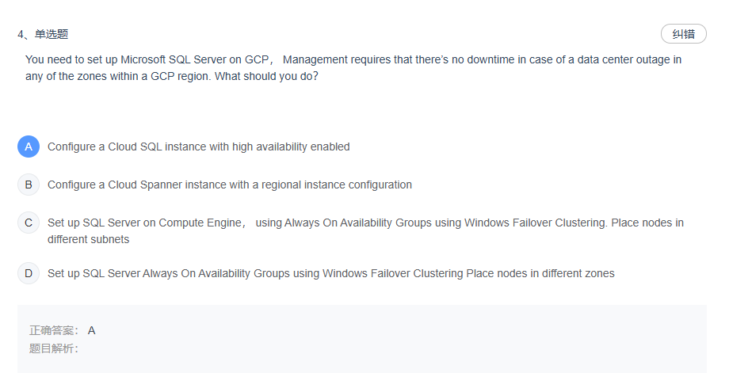
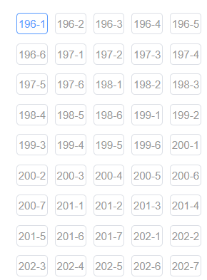
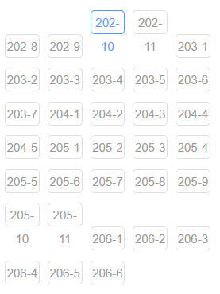

### 提示词一
---
```bash
我要做一个python访问url，提取返回json格式数据内容的程序。
url类似这样
https://ea.qingsuyun.com/h5/api/exercise/list/mainSwatch?mode=1&libraryId=042e86d045354de7a0fc18714586a0c9&mainIndex=4&practiceId=&pTime=1740466920253
其中 mainIndex 是题目顺序号，从1 到 x，需要指定。
pTime 是时间戳，最好可以真实，但是程序访问时，需要模拟出真实效果。

返回值是json数据，如下。
{
    "code": "200",
    "body": {
        "id": "24fcf2db6f6c4304a5f9ae428e0df00e",
        "parentId": "0",
        "questionType": 1,
        "questionContent": "You need to set up Microsoft SQL Server on GCP， Management requires that there\u0026rsquo;s no downtime in case of a data center outage in any of the zones within a GCP region. What should you do？",
        "rightAnswers": "0",
        "analysis": "",
        "difficulty": 2,
        "libraryId": "042e86d045354de7a0fc18714586a0c9",
        "jsonData": {
            "single": {
                "options": [
                    {
                        "optionsContent": " Configure a Cloud SQL instance with high availability enabled",
                        "sortIndex": 0,
                        "rightAnswers": true
                    },
                    {
                        "optionsContent": "Configure a Cloud Spanner instance with a regional instance configuration",
                        "sortIndex": 1,
                        "rightAnswers": false
                    },
                    {
                        "optionsContent": "Set up SQL Server on Compute Engine， using Always On Availability Groups using Windows Failover Clustering. Place nodes in different subnets",
                        "sortIndex": 2,
                        "rightAnswers": false
                    },
                    {
                        "optionsContent": "Set up SQL Server Always On Availability Groups using Windows Failover Clustering Place nodes in different zones",
                        "sortIndex": 3,
                        "rightAnswers": false
                    }
                ]
            }
        },
        "s": 4,
        "libraryName": "GCP-Professional Cloud Architect"
    }
}

页面显示内容截图


我要提取题号， 题目内容，答案选项，正确答案。

url访问 的认证 可能是 header中的 authorization:
6fc972642df545ad9704bcdb38520159
我需要尝试。

请给我python代码，可以设定 题号，保存提取的内容到文本文件。同时保存原始的json到不同的文件。

保存提取的内容和json数据分别到两个文件中，不要按题目分开文件保存。
```
---

### 提示词 2 
---
```bash
从196开始，这种格式的url
https://ea.qingsuyun.com/h5/api/exercise/list/mainSwatch?mode=1&libraryId=042e86d045354de7a0fc18714586a0c9&mainIndex=206&childIndex=3&practiceId=&pTime=1740468935066

有childIndex 代表这个题目是一个题目有多个问题。至于每道题目有几个问题，参考图片。



1. 根据图片提取出196 到206的每道题的问题数，按照这个问题数，设定访问的url。
2. 解析出题目内容，保存到多选题的文本文件和json文件。
3. 数据中的 html代码，回车换行等其他编码也要过滤掉。
4. 在之前代码的基础上，添加这个处理多个问题的方法，当题号属于多选题号时，用这个方法提取。
json 格式如下
{
    "code": "200",
    "body": {
        "id": "3f867124924747aab24589e46b2c4348",
        "parentId": "0",
        "questionType": 0,
        "questionContent": "\u0026nbsp;Introductory Info\u0026nbsp;\u003cbr /\u003e\nCompany Overview -\u0026nbsp;\u003cbr /\u003e\nJencoMart is a global retailer with over 10,000 stores in 16 countries. The stores carry a range of goods, such excellent ......improve our service to customers.\u0026nbsp;\u003cbr /\u003e\nCFO Statement -\u0026nbsp;\u003cbr /changing market trends, we need to outsource our infrastructure to ensure our long-term success. This model will allow us to respond to increasing customer demand during peak periods and reduce costs.",
        "difficulty": 2,
        "libraryId": "042e86d045354de7a0fc18714586a0c9",
        "jsonData": {},
        "child": {
            "id": "217e34751bb84224991d6ea96baab069",
            "parentId": "3f867124924747aab24589e46b2c4348",
            "questionType": 1,
            "questionContent": "The JencoMart security team requires that all Google Cloud Platform infrastructure is deployed using a least privilege model with separation of duties for administration between production and development resources.\u0026nbsp;\u003cbr /\u003eWhat Google domain and project structure should you recommend?",
            "rightAnswers": "2",
            "difficulty": 2,
            "libraryId": "042e86d045354de7a0fc18714586a0c9",
            "jsonData": {
                "single": {
                    "options": [
                        {
                            "optionsContent": " Create two G Suite accounts to manage users: one for development/test/staging and one for production. Each account should contain one project for every application",
                            "sortIndex": 0,
                            "rightAnswers": false
                        },
                        {
                            "optionsContent": " Create two G Suite accounts to manage users: one with a single project for all development applications and one with a single project for all production applications",
                            "sortIndex": 1,
                            "rightAnswers": false
                        },
                        {
                            "optionsContent": " Create a single G Suite account to manage users with each stage of each application in its own project",
                            "sortIndex": 2,
                            "rightAnswers": true
                        },
                        {
                            "optionsContent": " Create a single G Suite account to manage users with one project for the development/test/staging environment and one project for the production environment\u0026nbsp;",
                            "sortIndex": 3,
                            "rightAnswers": false
                        }
                    ]
                }
            },
            "s": 1,
            "libraryName": "GCP-Professional Cloud Architect"
        },
        "s": 196,
        "libraryName": "GCP-Professional Cloud Architect"
    }
}
```